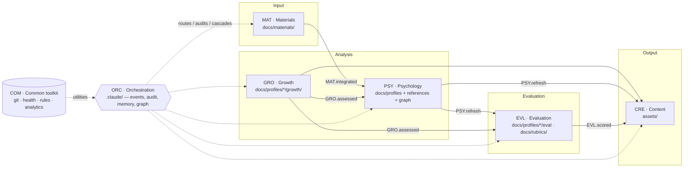
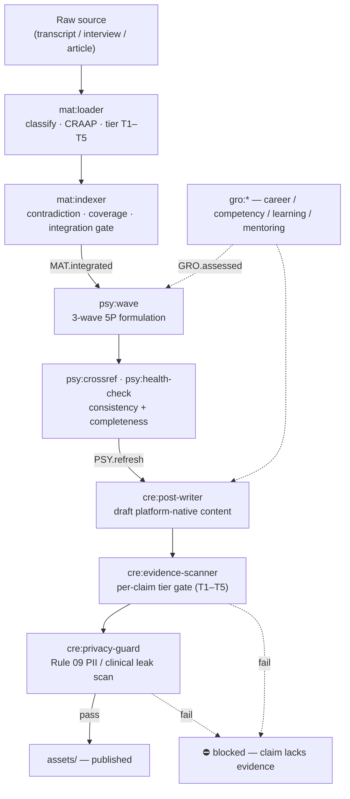
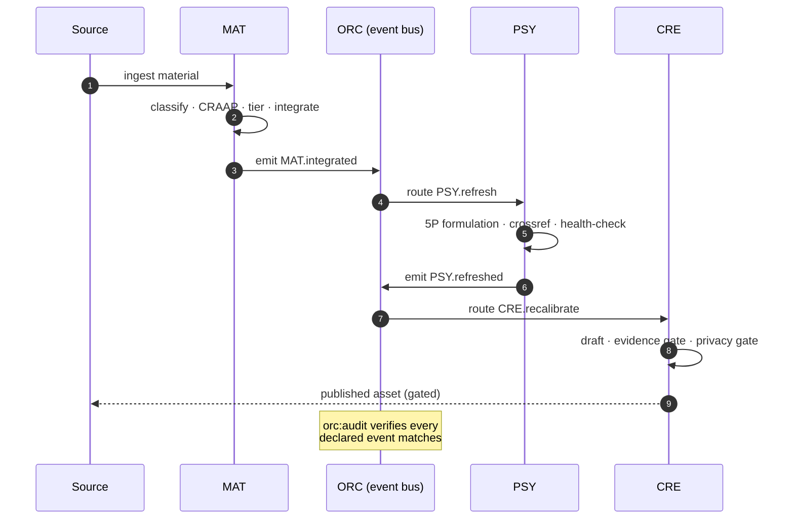
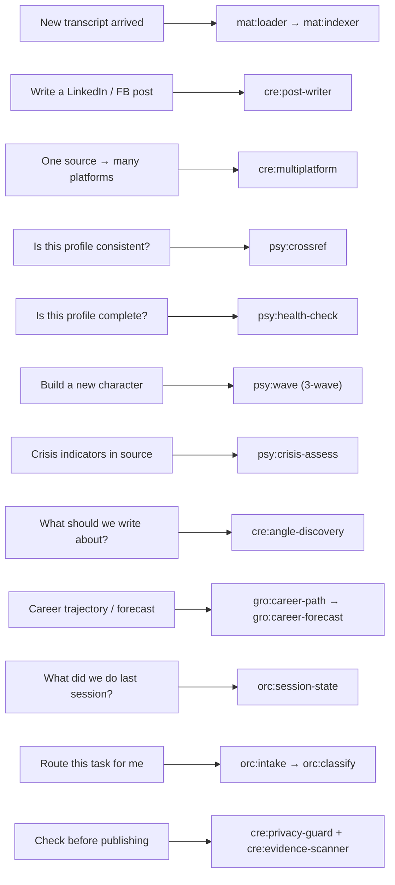
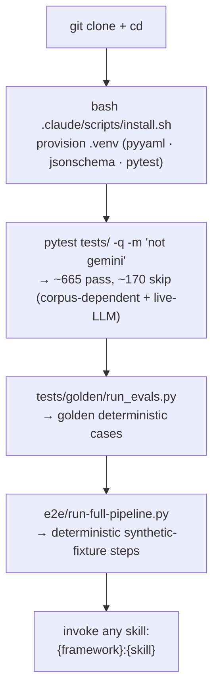
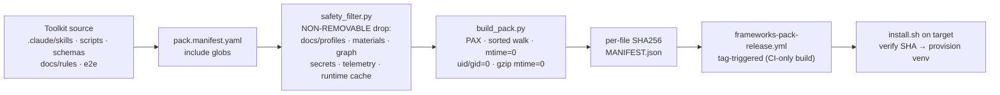
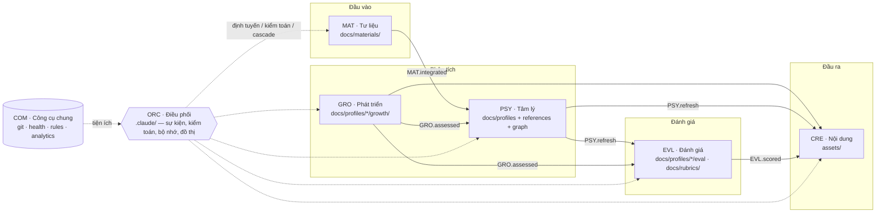
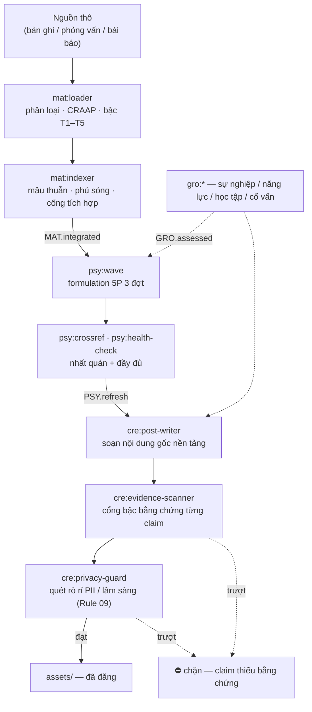
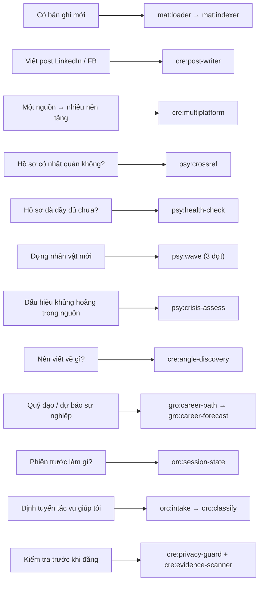
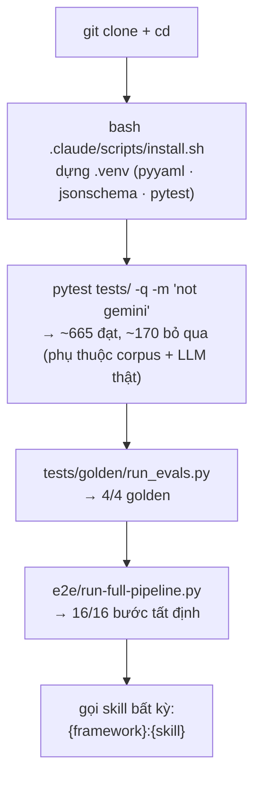

# Character Profile Intelligence System

A clinical-grade system that turns deep, evidence-backed psychological profiles of characters into
platform-native content. Built to **scale from a handful of characters to many** — tooling is
character-agnostic and resolves subjects dynamically via `paths.py`.

> **This is the public framework toolkit — it ships with _no_ real-person profiles, materials, or
> roster.** The character corpus is private by design; `docs/profiles/`, `docs/materials/`,
> `docs/graph/`, `docs/references/`, and `assets/` are intentionally absent here. Bring your own
> subjects: create `docs/profiles/characters.yaml` and the tooling resolves them dynamically. With no
> corpus present the suite degrades cleanly (corpus-dependent tests skip; the toolkit still imports,
> compiles, and builds). Licensed **AGPL-3.0** — see [`LICENSE`](./LICENSE) and [`CONTRIBUTING.md`](./CONTRIBUTING.md).
> Network/SaaS use of a modified version must release its full source under AGPL-3.0.

> **For Claude Code / LLM agents:** read [`CLAUDE.md`](./CLAUDE.md) (architecture + rules + workflow) and
> the rule files under [`docs/rules/`](./docs/rules/). Every skill ships a 4-doc spine —
> `SKILL.md` (contract) + `README.md` + `GUIDE-EN.md` + `GUIDE-VI.md`. This README is the human entry point.
>
> 🇻🇳 Tiếng Việt: nhảy tới [**# Tiếng Việt**](#tiếng-việt) bên dưới — bản dịch đầy đủ.

**Contents** ·
[What it does](#what-it-does) ·
[Architecture](#architecture) ·
[Event flow](#event-flow--processing) ·
[Use cases](#use-cases) ·
[Quick start](#quick-start) ·
[The seven frameworks](#the-seven-frameworks) ·
[Skill catalog (68)](#skill-catalog--68-skills) ·
[Examples & e2e](#examples--end-to-end) ·
[Distribution](#distribution--packaging) ·
[Tests & gates](#tests--gates) ·
[Troubleshooting](#troubleshooting) ·
[Privacy](#privacy)

---

## What it does

1. **Ingest** raw source material (transcripts, interviews, logs, articles) and score it for evidence quality.
2. **Analyze** it into a structured clinical profile — case formulation, defenses, attachment, trauma, strengths, timeline, growth.
3. **Generate** platform content (Facebook, LinkedIn, blog, …), gated by evidence tier and confidentiality.

Everything is **event-driven**: ingesting material cascades into a profile refresh, which cascades into
content recalibration. **68 framework skills** across **7 frameworks**, invoked as `{framework}:{skill}`
(e.g. `psy:crossref`). The full per-skill catalog is below and in [`CLAUDE.md`](./CLAUDE.md); per-skill
walkthroughs live in each skill's `GUIDE-EN.md` / `GUIDE-VI.md`.

---

## Architecture

Five domain frameworks + one orchestrator + one common toolkit, wired by an event bus. Each framework
**owns exactly one data location** and communicates through events — never cross-domain direct writes
(enforced by [Rule 12](./docs/rules/12-orc-orchestration.md) + `platform_lib/fs_guard.py`).



| Framework | Type | Owns (write root) | Purpose |
| --- | --- | --- | --- |
| **MAT** | Domain | `docs/materials/` | Evidence ingestion, tiers T1–T5, CRAAP |
| **PSY** | Domain | `docs/profiles/` · `docs/references/` · `docs/graph/` | Clinical 5P formulation |
| **CRE** | Domain | `assets/` | Platform content creation |
| **GRO** | Domain | `docs/profiles/*/growth/` | Career + competency intelligence |
| **EVL** | Domain | `docs/profiles/*/eval/` · `docs/rubrics/` | Evidence-cited rubric scoring + verdicts |
| **ORC** | Orchestrator | `.claude/` | Event routing, domain boundaries, memory, graph |
| **COM** | Common | `.claude/` | Git, health-check, rules, observability |

---

## Event flow / processing

The primary pipeline is a cascade. Material must be **integrated** before PSY may consume it (MAT gates
block premature analysis); content is gated **per-claim** by evidence tier and **per-asset** by
confidentiality before it can be published.



The same cascade as a sequence — note ORC is the event bus, not a content owner:



---

## Use cases

"I want to…" → the skill (or chain) that does it. Every node deep-links to its `GUIDE-EN.md` in the
[catalog below](#skill-catalog--68-skills).



---

## Quick start



The project is **self-contained** — all skills, scripts, rules, schemas, and the venv live under `.claude/`.
Run any skill script with the project-local interpreter:

```bash
# 1. First run — provision the virtualenv
bash .claude/scripts/install.sh

# 2. Invoke a skill script directly
.claude/skills/.venv/bin/python3 .claude/skills/{framework}-{skill}/scripts/{script}.py [args]

# example: score a character's profile completeness (needs a roster + profile; the synthetic
# e2e fixture under e2e/synthetic-project/ is a ready-made one to try against)
.claude/skills/.venv/bin/python3 \
  .claude/skills/psy-health-check/scripts/score-profile-completeness.py --character <your-slug>
```

When working *through Claude Code*, you don't call scripts by hand — you invoke skills by name
(`psy:health-check`, `cre:post-writer`, …) and the skill orchestrates its own scripts + LLM reasoning.

---

## The seven frameworks

### `MAT` — Materials (input) · 4 skills

**Does:** ingests + classifies source material into `docs/materials/` with evidence tiers (T1–T5) and
CRAAP quality scores, through a 5-stage pipeline (raw → extracted → analyzed → validated → integrated).
Material must be **integrated before PSY may analyse it**.
**Rules:** [`04`](./docs/rules/04-materials-ingestion.md) · [`11`](./docs/rules/11-mat-pipeline.md).
**Does NOT:** write outside `docs/materials/`; analyse psychology (that's PSY); conflate tier (source type) with CRAAP (quality).

### `PSY` — Psychology (analysis) · 16 skills

**Does:** builds + refreshes the clinical 5P formulation, defenses, attachment, diagnostics (Big Five +
ICD-11), trauma, strengths, timeline, and cross-character consistency from integrated material + the theory library.
**Rules:** [`01`](./docs/rules/01-profile-structure.md) · [`02`](./docs/rules/02-clinical-reference-usage.md) · [`08`](./docs/rules/08-cross-validation.md) · [`06`](./docs/rules/06-crisis-protocol.md).
**Does NOT:** expose raw psychiatric labels in published content (show-don't-tell, Rule 02); cache crisis verdicts (always re-assessed); write outside `docs/profiles` · `references` · `graph`.

### `CRE` — Content (output) · 10 skills

**Does:** translates the refreshed profile into platform-native content under `assets/`, gated per-claim
by evidence tier (T1–T5) and per-asset by confidentiality + voice consistency before publish.
**Rules:** [`03`](./docs/rules/03-content-creation-pipeline.md) · [`09`](./docs/rules/09-confidentiality-protocol.md) · [`14`](./docs/rules/14-cre-evidence-and-events.md).
**Does NOT:** publish content failing the evidence/privacy gates; edit profiles or materials; write outside `assets/`.

### `GRO` — Growth · 8 skills

**Does:** career-trajectory, competency (Dreyfus), learning-profile (Kolb), and mentoring (Kram)
intelligence feeding PSY + CRE. Forecasts are explicitly labelled `[FORECAST — NOT FACTUAL]`.
**Rules:** [`15`](./docs/rules/15-gro-framework.md).
**Does NOT:** clinical analysis (the GRO↔PSY boundary, Rule 15); write outside `docs/profiles/*/growth/`.

### `ORC` — Orchestration · 17 skills

**Does:** routes events across domains, resolves cascades, audits cross-domain consistency, and owns
session state, memory, decisions, and the knowledge graph.
**Rules:** [`12`](./docs/rules/12-orc-orchestration.md) · [`13`](./docs/rules/13-orc-workflow.md) · [`16`](./docs/rules/16-knowledge-graph.md).
**Does NOT:** own content — it routes and audits; writes only `.claude/`.

### `COM` — Common · 5 skills

**Does:** shared toolkit — git operations, session-health monitoring, rules management, release
cutting (Keep a Changelog lifecycle), and skill/script observability (11 read-only lenses).
**Does NOT:** edit domain content; utility only.

### `EVL` — Evaluation · 8 skills

**Does:** scores a character against pluggable, versioned rubrics (psychometric · decision/role-fit ·
clinical-risk · dyad compatibility) → an evidence-cited scorecard + verdict. Scripts do deterministic
gathering + weighted aggregation; the LLM does the per-criterion judgment. Every criterion cites a MAT
evidence tier (T1–T5) — an uncited score is reported `[UNVERIFIED]` (counted, never a silent pass).
High-stakes rubrics use ≥2 independent judges → convergence (a divergence routes to manual review,
never an auto-average). Rubrics live in [`docs/rubrics/`](./docs/rubrics/), validated against a JSON-schema.
**Rules:** [`17`](./docs/rules/17-evl-framework.md).
**Does NOT:** consume CRE content — evaluation is a forward-only sink (`EVL.scored` may feed CRE, never the reverse); write outside `docs/profiles/*/eval/` · `docs/rubrics/`.

---

## Skill catalog — 68 skills

Invoke as `{framework}:{skill}`. Each row deep-links its bilingual walkthrough (`GUIDE-EN` / `GUIDE-VI`).
`SKILL.md` is the operating contract; `CLAUDE.md` is the canonical index (the `bug_class` CI gate asserts
this count stays in sync).

### MAT — Materials (4)

| Skill | Purpose | Guide |
| --- | --- | --- |
| `mat:loader` | Ingest, classify, CRAAP-score, frontmatter-inject source → `docs/materials/` (stage 1–2) | [EN](./.claude/skills/mat-loader/GUIDE-EN.md) · [VI](./.claude/skills/mat-loader/GUIDE-VI.md) |
| `mat:indexer` | Contradiction detection, coverage gaps, integration gate (stage 3–4) | [EN](./.claude/skills/mat-indexer/GUIDE-EN.md) · [VI](./.claude/skills/mat-indexer/GUIDE-VI.md) |
| `mat:archive` | Soft-delete / archive processed materials with audit trail (dry-run default) | [EN](./.claude/skills/mat-archive/GUIDE-EN.md) · [VI](./.claude/skills/mat-archive/GUIDE-VI.md) |
| `mat:rescore` | Flag materials with missing / stale CRAAP scores for re-evaluation | [EN](./.claude/skills/mat-rescore/GUIDE-EN.md) · [VI](./.claude/skills/mat-rescore/GUIDE-VI.md) |

### PSY — Psychology (16)

| Skill | Purpose | Guide |
| --- | --- | --- |
| `psy:wave` | 3-wave profile build/refresh (Foundation → Deep Dive → Validation) | [EN](./.claude/skills/psy-wave/GUIDE-EN.md) · [VI](./.claude/skills/psy-wave/GUIDE-VI.md) |
| `psy:crossref` | Cross-character consistency — 10 dimensions (4 automated + 6 LLM) | [EN](./.claude/skills/psy-crossref/GUIDE-EN.md) · [VI](./.claude/skills/psy-crossref/GUIDE-VI.md) |
| `psy:crisis-assess` | DSM-5 / ICD-11 crisis indicators + risk levels (never cached) | [EN](./.claude/skills/psy-crisis-assess/GUIDE-EN.md) · [VI](./.claude/skills/psy-crisis-assess/GUIDE-VI.md) |
| `psy:health-check` | Profile completeness scoring — 25 files × quality, 0–100 | [EN](./.claude/skills/psy-health-check/GUIDE-EN.md) · [VI](./.claude/skills/psy-health-check/GUIDE-VI.md) |
| `psy:timeline-sync` | Cross-character timeline date validation + fix suggestions | [EN](./.claude/skills/psy-timeline-sync/GUIDE-EN.md) · [VI](./.claude/skills/psy-timeline-sync/GUIDE-VI.md) |
| `psy:narrative-twist` | Handle revealed falsehoods — strikethrough + ⚠️ + cascade | [EN](./.claude/skills/psy-narrative-twist/GUIDE-EN.md) · [VI](./.claude/skills/psy-narrative-twist/GUIDE-VI.md) |
| `psy:hypothesis` | Predict behavior given hypothetical events (arc planning) | [EN](./.claude/skills/psy-hypothesis/GUIDE-EN.md) · [VI](./.claude/skills/psy-hypothesis/GUIDE-VI.md) |
| `psy:arc-tracker` | Track growth arcs — hypothesis prediction vs actual evolution | [EN](./.claude/skills/psy-arc-tracker/GUIDE-EN.md) · [VI](./.claude/skills/psy-arc-tracker/GUIDE-VI.md) |
| `psy:propagate` | Cross-character cascade — which connected files need review | [EN](./.claude/skills/psy-propagate/GUIDE-EN.md) · [VI](./.claude/skills/psy-propagate/GUIDE-VI.md) |
| `psy:profile-lite` | Compress full profile → token-efficient summary (~95% smaller) | [EN](./.claude/skills/psy-profile-lite/GUIDE-EN.md) · [VI](./.claude/skills/psy-profile-lite/GUIDE-VI.md) |
| `psy:profile-compare` | Side-by-side dimension comparison across characters | [EN](./.claude/skills/psy-profile-compare/GUIDE-EN.md) · [VI](./.claude/skills/psy-profile-compare/GUIDE-VI.md) |
| `psy:ref-audit` | Profile → reference accuracy + `--discover` blind spots | [EN](./.claude/skills/psy-ref-audit/GUIDE-EN.md) · [VI](./.claude/skills/psy-ref-audit/GUIDE-VI.md) |
| `psy:ref-scan` | Reference → profile coverage mapping (theory → applications) | [EN](./.claude/skills/psy-ref-scan/GUIDE-EN.md) · [VI](./.claude/skills/psy-ref-scan/GUIDE-VI.md) |
| `psy:ref-create` | Create new clinical theory reference (mandatory schema) | [EN](./.claude/skills/psy-ref-create/GUIDE-EN.md) · [VI](./.claude/skills/psy-ref-create/GUIDE-VI.md) |
| `psy:ref-maintain` | Reference library cleanup — orphans, outdated, duplicates | [EN](./.claude/skills/psy-ref-maintain/GUIDE-EN.md) · [VI](./.claude/skills/psy-ref-maintain/GUIDE-VI.md) |
| `psy:relation-intelligence` | Mine dyad graph for ranked, consent-gated content angles | [EN](./.claude/skills/psy-relation-intelligence/GUIDE-EN.md) · [VI](./.claude/skills/psy-relation-intelligence/GUIDE-VI.md) |

### CRE — Content (10)

| Skill | Purpose | Guide |
| --- | --- | --- |
| `cre:post-writer` | End-to-end content pipeline — profile → voice → draft → `assets/` | [EN](./.claude/skills/cre-post-writer/GUIDE-EN.md) · [VI](./.claude/skills/cre-post-writer/GUIDE-VI.md) |
| `cre:multiplatform` | 1→N platform-NATIVE variant generation (per-variant gated) | [EN](./.claude/skills/cre-multiplatform/GUIDE-EN.md) · [VI](./.claude/skills/cre-multiplatform/GUIDE-VI.md) |
| `cre:repurpose` | Adapt one published post to another platform (1→1) | [EN](./.claude/skills/cre-repurpose/GUIDE-EN.md) · [VI](./.claude/skills/cre-repurpose/GUIDE-VI.md) |
| `cre:angle-discovery` | Mine all 7 frameworks for ranked, evidence-backed content angles | [EN](./.claude/skills/cre-angle-discovery/GUIDE-EN.md) · [VI](./.claude/skills/cre-angle-discovery/GUIDE-VI.md) |
| `cre:exploring` | 7-question structured exploration → `CONTEXT.md` | [EN](./.claude/skills/cre-exploring/GUIDE-EN.md) · [VI](./.claude/skills/cre-exploring/GUIDE-VI.md) |
| `cre:prompt-leverage` | 5-layer prompt strengthening before execution | [EN](./.claude/skills/cre-prompt-leverage/GUIDE-EN.md) · [VI](./.claude/skills/cre-prompt-leverage/GUIDE-VI.md) |
| `cre:evidence-scanner` | Per-claim evidence-tier gate (T1–T5) + Rule-09 leak detection | [EN](./.claude/skills/cre-evidence-scanner/GUIDE-EN.md) · [VI](./.claude/skills/cre-evidence-scanner/GUIDE-VI.md) |
| `cre:humanize` | De-AI-slop scan (VN+EN tells) + opt-in rewrite; runs before voice-audit | [EN](./.claude/skills/cre-humanize/GUIDE-EN.md) · [VI](./.claude/skills/cre-humanize/GUIDE-VI.md) |
| `cre:privacy-guard` | Pre-publish privacy / confidentiality scan of `assets/` | [EN](./.claude/skills/cre-privacy-guard/GUIDE-EN.md) · [VI](./.claude/skills/cre-privacy-guard/GUIDE-VI.md) |
| `cre:voice-audit` | Audit content voice/tone vs `identity/writing-voice.md` | [EN](./.claude/skills/cre-voice-audit/GUIDE-EN.md) · [VI](./.claude/skills/cre-voice-audit/GUIDE-VI.md) |

### GRO — Growth (8)

| Skill | Purpose | Guide |
| --- | --- | --- |
| `gro:career-path` | Career trajectory analysis + stage mapping (Super) | [EN](./.claude/skills/gro-career-path/GUIDE-EN.md) · [VI](./.claude/skills/gro-career-path/GUIDE-VI.md) |
| `gro:competency-map` | Competency assessment + gap analysis (Dreyfus 7-level) | [EN](./.claude/skills/gro-competency-map/GUIDE-EN.md) · [VI](./.claude/skills/gro-competency-map/GUIDE-VI.md) |
| `gro:learning-profile` | Learning style + acquisition patterns (Kolb) | [EN](./.claude/skills/gro-learning-profile/GUIDE-EN.md) · [VI](./.claude/skills/gro-learning-profile/GUIDE-VI.md) |
| `gro:mentoring-track` | Mentoring relationship documentation + insights (Kram) | [EN](./.claude/skills/gro-mentoring-track/GUIDE-EN.md) · [VI](./.claude/skills/gro-mentoring-track/GUIDE-VI.md) |
| `gro:career-forecast` | LLM career projection `[FORECAST — NOT FACTUAL]` | [EN](./.claude/skills/gro-career-forecast/GUIDE-EN.md) · [VI](./.claude/skills/gro-career-forecast/GUIDE-VI.md) |
| `gro:milestone-tracker` | Track career milestones actual vs planned | [EN](./.claude/skills/gro-milestone-tracker/GUIDE-EN.md) · [VI](./.claude/skills/gro-milestone-tracker/GUIDE-VI.md) |
| `gro:compare` | Side-by-side career comparison across characters | [EN](./.claude/skills/gro-compare/GUIDE-EN.md) · [VI](./.claude/skills/gro-compare/GUIDE-VI.md) |
| `gro:validate` | Cross-check growth data consistency + date alignment | [EN](./.claude/skills/gro-validate/GUIDE-EN.md) · [VI](./.claude/skills/gro-validate/GUIDE-VI.md) |

### ORC — Orchestration (17)

| Skill | Purpose | Guide |
| --- | --- | --- |
| `orc:bootstrap` | Load project context (`--quick`/`--full`/`--character`/`--lite`) | [EN](./.claude/skills/orc-bootstrap/GUIDE-EN.md) · [VI](./.claude/skills/orc-bootstrap/GUIDE-VI.md) |
| `orc:intake` | Classify work type → optimal skill chain | [EN](./.claude/skills/orc-intake/GUIDE-EN.md) · [VI](./.claude/skills/orc-intake/GUIDE-VI.md) |
| `orc:classify` | Risk classification (tiny/normal/high_risk) + MAT gates | [EN](./.claude/skills/orc-classify/GUIDE-EN.md) · [VI](./.claude/skills/orc-classify/GUIDE-VI.md) |
| `orc:session-state` | Track session state, framework domains, event queue | [EN](./.claude/skills/orc-session-state/GUIDE-EN.md) · [VI](./.claude/skills/orc-session-state/GUIDE-VI.md) |
| `orc:event-log` | Persistent event audit log (JSONL append + query) | [EN](./.claude/skills/orc-event-log/GUIDE-EN.md) · [VI](./.claude/skills/orc-event-log/GUIDE-VI.md) |
| `orc:domain-router` | Route domain events to downstream skills (diff or explicit) | [EN](./.claude/skills/orc-domain-router/GUIDE-EN.md) · [VI](./.claude/skills/orc-domain-router/GUIDE-VI.md) |
| `orc:cascade` | Resolve multi-step event cascade chains across domains | [EN](./.claude/skills/orc-cascade/GUIDE-EN.md) · [VI](./.claude/skills/orc-cascade/GUIDE-VI.md) |
| `orc:audit` | Cross-domain event consistency verification | [EN](./.claude/skills/orc-audit/GUIDE-EN.md) · [VI](./.claude/skills/orc-audit/GUIDE-VI.md) |
| `orc:graph` | Knowledge-graph query / visualize / validate / analytics | [EN](./.claude/skills/orc-graph/GUIDE-EN.md) · [VI](./.claude/skills/orc-graph/GUIDE-VI.md) |
| `orc:council` | 4-voice decision framework — anti-anchoring, verdict storage | [EN](./.claude/skills/orc-council/GUIDE-EN.md) · [VI](./.claude/skills/orc-council/GUIDE-VI.md) |
| `orc:santa` | Dual-reviewer quality gate — independent review, max 2 rounds | [EN](./.claude/skills/orc-santa/GUIDE-EN.md) · [VI](./.claude/skills/orc-santa/GUIDE-VI.md) |
| `orc:decisions` | Append-only decision records (prevents re-litigation) | [EN](./.claude/skills/orc-decisions/GUIDE-EN.md) · [VI](./.claude/skills/orc-decisions/GUIDE-VI.md) |
| `orc:agent-memory` | Per-agent calibration memory (read-before / write-after) | [EN](./.claude/skills/orc-agent-memory/GUIDE-EN.md) · [VI](./.claude/skills/orc-agent-memory/GUIDE-VI.md) |
| `orc:compounding` | Extract durable session learnings → memory | [EN](./.claude/skills/orc-compounding/GUIDE-EN.md) · [VI](./.claude/skills/orc-compounding/GUIDE-VI.md) |
| `orc:dream` | Periodic memory consolidation (merge / prune / strengthen) | [EN](./.claude/skills/orc-dream/GUIDE-EN.md) · [VI](./.claude/skills/orc-dream/GUIDE-VI.md) |
| `orc:observe` | Passive cross-framework observation signals → instinct | [EN](./.claude/skills/orc-observe/GUIDE-EN.md) · [VI](./.claude/skills/orc-observe/GUIDE-VI.md) |
| `orc:skill-stocktake` | Skill catalog audit — count / metadata / overlap | [EN](./.claude/skills/orc-skill-stocktake/GUIDE-EN.md) · [VI](./.claude/skills/orc-skill-stocktake/GUIDE-VI.md) |

### COM — Common (5)

| Skill | Purpose | Guide |
| --- | --- | --- |
| `com:git` | Project-aware git operations (conventional commits, secret-scan) | [EN](./.claude/skills/com-git/GUIDE-EN.md) · [VI](./.claude/skills/com-git/GUIDE-VI.md) |
| `com:health-check` | Session health — stall / error / death detection | [EN](./.claude/skills/com-health-check/GUIDE-EN.md) · [VI](./.claude/skills/com-health-check/GUIDE-VI.md) |
| `com:rules` | Modular rules management + change validation | [EN](./.claude/skills/com-rules/GUIDE-EN.md) · [VI](./.claude/skills/com-rules/GUIDE-VI.md) |
| `com:skill-analytics` | Skill/script observability — 11 read-only lenses | [EN](./.claude/skills/com-skill-analytics/GUIDE-EN.md) · [VI](./.claude/skills/com-skill-analytics/GUIDE-VI.md) |
| `com:release` | Cut a versioned frameworks-pack release (Keep a Changelog lifecycle) | [EN](./.claude/skills/com-release/GUIDE-EN.md) · [VI](./.claude/skills/com-release/GUIDE-VI.md) |

### EVL — Evaluation (8)

| Skill | Purpose | Guide |
| --- | --- | --- |
| `evl:score` | Score a character against any versioned rubric → evidence-cited scorecard + verdict | [EN](./.claude/skills/evl-score/GUIDE-EN.md) · [VI](./.claude/skills/evl-score/GUIDE-VI.md) |
| `evl:standardize` | Psychometric-battery preset — Big Five + Dark Triad (SD3) + Attachment (ECR-R) | [EN](./.claude/skills/evl-standardize/GUIDE-EN.md) · [VI](./.claude/skills/evl-standardize/GUIDE-VI.md) |
| `evl:fit` | Role / casting-fit decision engine (≥2 independent judges → convergence) | [EN](./.claude/skills/evl-fit/GUIDE-EN.md) · [VI](./.claude/skills/evl-fit/GUIDE-VI.md) |
| `evl:compatibility` | Dyad rubric scoring — a PAIR of characters on a relationship-compatibility rubric | [EN](./.claude/skills/evl-compatibility/GUIDE-EN.md) · [VI](./.claude/skills/evl-compatibility/GUIDE-VI.md) |
| `evl:compare` | Cross-character ranking on the same rubric (reuses written scorecards) | [EN](./.claude/skills/evl-compare/GUIDE-EN.md) · [VI](./.claude/skills/evl-compare/GUIDE-VI.md) |
| `evl:track` | Score-over-time tracker — verdict / coverage delta vs the prior scorecard | [EN](./.claude/skills/evl-track/GUIDE-EN.md) · [VI](./.claude/skills/evl-track/GUIDE-VI.md) |
| `evl:validate` | Deterministic structural checker — rubric shape + scorecard cross-field invariants | [EN](./.claude/skills/evl-validate/GUIDE-EN.md) · [VI](./.claude/skills/evl-validate/GUIDE-VI.md) |
| `evl:rubric-import` | Ingest an external framework (file / text / URL) → canonical rubric schema | [EN](./.claude/skills/evl-rubric-import/GUIDE-EN.md) · [VI](./.claude/skills/evl-rubric-import/GUIDE-VI.md) |

---

## Examples & end-to-end

A fully **synthetic 2-character corpus** (no real PII) lives under [`e2e/synthetic-project/`](./e2e/synthetic-project/)
— it doubles as a worked example, the eval fixture, and the regression harness. The harness exercises the
**deterministic leg** of all 6 frameworks plus the shared `platform_lib` cache/preferences CLIs:

```bash
.claude/skills/.venv/bin/python3 e2e/run-full-pipeline.py            # run (16 steps)
.claude/skills/.venv/bin/python3 e2e/run-full-pipeline.py --write-log # + refresh RUN-LOG
```

What the run covers (see [`e2e/RUN-LOG-six-framework-deterministic-pipeline.md`](./e2e/RUN-LOG-six-framework-deterministic-pipeline.md)):

| Leg | Steps exercised |
| --- | --- |
| **PSY** | health-check completeness · crossref (timeline / bidirectional refs / event extraction) · timeline-sync |
| **GRO** | validate growth · competency gather |
| **MAT** | indexer (coverage gaps / stale) · loader (inventory / dup detection) |
| **CRE** | privacy-guard (asset scan / confidential names) |
| **LIB** | verdict_cache (crisis = never-cached · store→hit) · preferences (read knobs) |

> The **LLM-judgment legs** (crossref's 6 heuristic dimensions, voice-audit, council, …) require a
> `GEMINI_API_KEY` and are exercised by [`tests/test_llm_e2e_scenario_with_gemini.py`](./tests/test_llm_e2e_scenario_with_gemini.py)
> (34 cases, key-gated). Without a key they skip — by design, not failure.

---

## Distribution / packaging

The 7-framework toolkit is packaged **deterministically** (same source + manifest ⇒ byte-identical
`tar.gz`) and ships **only the toolkit, never the live character corpus**. A non-removable safety filter
drops PII / secrets / runtime state *after* the manifest include-globs, so a misconfigured include can
never leak clinical data.



Build + verify locally:

```bash
.claude/skills/.venv/bin/python3 .claude/skills/_framework-shared/scripts/build_pack.py          # → dist/ tarball + MANIFEST
.claude/skills/.venv/bin/python3 -m pytest tests/test_pack_determinism_and_safety.py -q
```

> **Distribution is opt-in.** If you only run the system in-repo you never need the pack — it exists for
> vendoring the framework toolkit into another project. Release builds are **CI-only** (a hand-built
> tarball's SHA would not match the recipient's verified SHA).

---

## Tests & gates

All deterministic — no API key required. Also run in CI (`.github/workflows/`):

```bash
.claude/skills/.venv/bin/python3 -m pytest tests/ -q            # full deterministic suite (~885 pass, ~175 skip without a roster)
.claude/skills/.venv/bin/python3 -m pytest tests/ -m bug_class  # closed-bug-class invariants
.claude/skills/.venv/bin/python3 tests/golden/run_evals.py        # golden deterministic-skill evals
.claude/skills/.venv/bin/python3 tests/golden/run_skill_evals.py  # per-skill structural skill-evals
.claude/skills/.venv/bin/python3 e2e/run-full-pipeline.py       # synthetic-fixture pipeline run
.claude/skills/.venv/bin/python3 .claude/scripts/validate-all-against-schemas.py  # 119 files vs schemas
```

| Workflow | Gate |
| --- | --- |
| [`frameworks-ci.yml`](./.github/workflows/frameworks-ci.yml) | py_compile · import sweep · schema validation · `orc:audit` exit-0 · pytest · eval |
| [`cross-framework-bug-class.yml`](./.github/workflows/cross-framework-bug-class.yml) | `pytest -m bug_class` — guards a *class* of bug (orphan import, centralized-constant redefinition, non-recursive glob, skill-count drift) |
| [`public-ci-guard.yml`](./.github/workflows/public-ci-guard.yml) | fail-closed perimeter — blocks any private-corpus / ck path from re-entering the public repo |

---

## Bilingual

Every skill ships `GUIDE-EN.md` + `GUIDE-VI.md` (use-case-as-conversation). Skill IDs, flag names,
frontmatter keys, and event names stay **English**; prose + examples **localize**. Vietnamese is
native-quality with full diacritics. The clinical corpus (profiles, materials) is authored in Vietnamese.

---

## Troubleshooting

| Symptom | Cause | Fix |
| --- | --- | --- |
| `ModuleNotFoundError: yaml / jsonschema / pytest` | venv not provisioned | `bash .claude/scripts/install.sh` |
| A script "scans nothing" for a character | passing an alias the resolver doesn't know | use a known slug/alias; tooling resolves via `paths.resolve_character()` |
| `pytest` collection error after a refactor | a test imports a removed module | the `bug_class` gate catches this — run `pytest -m bug_class` |
| 34 tests skipped | live-LLM tests need `GEMINI_API_KEY` | expected; set a key (or `.env`) to run them, else they skip by design |
| Verdict cache feels stale | content unchanged ⇒ cache hit by design | pass `--fresh` to force a re-judge (crisis/twist are never cached) |
| Skill count mismatch warning | `CLAUDE.md` catalog out of sync | the `bug_class` gate asserts count == catalog |

---

## Privacy

This is clinical-grade data. Confidentiality is enforced by [Rule 09](./docs/rules/09-confidentiality-protocol.md):
privacy tags gate what reaches published content; `cre:privacy-guard` + `cre:evidence-scanner` scan before publish.
Committed caches store **verdict labels only — never raw profile text**. The distribution pack
(the pack builder) drops the live character corpus, telemetry, runtime caches, and secrets. The synthetic e2e
fixture under `e2e/` contains **no real PII**.

---

## Documentation

| Topic | File |
| --- | --- |
| LLM context (start here) | [`CLAUDE.md`](./CLAUDE.md) |
| Domain rules (16) | [`docs/rules/`](./docs/rules/) |
| Shared operating guides + GATEs | [`.claude/skills/_framework-shared/references/`](./.claude/skills/_framework-shared/references/) |
| Knowledge architecture / module map | [`docs/knowledge-architecture.md`](./docs/knowledge-architecture.md) · [`docs/MODULES.md`](./docs/MODULES.md) |
| Distilled cross-domain principles | [`docs/distilled-principles.md`](./docs/distilled-principles.md) |
| License (AGPL-3.0) | [`LICENSE`](./LICENSE) |
| How to contribute | [`CONTRIBUTING.md`](./CONTRIBUTING.md) |

---
---

# Tiếng Việt

Hệ thống tình báo hồ sơ nhân vật **cấp lâm sàng** — biến hồ sơ tâm lý sâu, có bằng chứng, thành nội dung
gốc cho từng nền tảng. Thiết kế để **mở rộng từ vài nhân vật đến rất nhiều** — công cụ trung lập với nhân vật,
phân giải động qua `paths.py`.

> **Cho Claude Code / LLM agent:** đọc [`CLAUDE.md`](./CLAUDE.md) (kiến trúc + quy tắc + quy trình) và các
> file quy tắc trong [`docs/rules/`](./docs/rules/). Mỗi skill có bộ 4 tài liệu — `SKILL.md` (hợp đồng) +
> `README.md` + `GUIDE-EN.md` + `GUIDE-VI.md`.

**Mục lục** ·
[Làm gì](#hệ-thống-làm-gì) ·
[Kiến trúc](#kiến-trúc) ·
[Luồng xử lý](#luồng-sự-kiện--xử-lý) ·
[Use case](#trường-hợp-sử-dụng) ·
[Bắt đầu nhanh](#bắt-đầu-nhanh) ·
[Bảy framework](#bảy-framework) ·
[Danh mục skill (68)](#danh-mục-skill--68) ·
[Ví dụ & e2e](#ví-dụ--end-to-end) ·
[Phân phối](#phân-phối--đóng-gói) ·
[Kiểm thử](#kiểm-thử--cổng-gác) ·
[Quyền riêng tư](#quyền-riêng-tư)

## Hệ thống làm gì

1. **Thu nhận** tư liệu nguồn (bản ghi, phỏng vấn, log, bài báo) và chấm điểm chất lượng bằng chứng.
2. **Phân tích** thành hồ sơ lâm sàng có cấu trúc — case formulation, cơ chế phòng vệ, gắn bó, sang chấn, sức mạnh, dòng thời gian, phát triển.
3. **Tạo** nội dung nền tảng (Facebook, LinkedIn, blog…), kiểm soát theo bậc bằng chứng + bảo mật.

Tất cả **theo sự kiện**: thêm tư liệu → làm mới hồ sơ → hiệu chỉnh nội dung. **68 skill** trên **7 framework**,
gọi dạng `{framework}:{skill}` (vd `psy:crossref`).

## Kiến trúc

Năm framework miền + một bộ điều phối + một bộ công cụ chung, nối bằng event bus. Mỗi framework **sở hữu đúng
một vị trí dữ liệu** và giao tiếp qua sự kiện — không bao giờ ghi chéo miền ([Rule 12](./docs/rules/12-orc-orchestration.md)
+ `platform_lib/fs_guard.py` cưỡng chế).



| Framework | Loại | Sở hữu (gốc ghi) | Mục đích |
| --- | --- | --- | --- |
| **MAT** | Miền | `docs/materials/` | Thu nhận bằng chứng, bậc T1–T5, CRAAP |
| **PSY** | Miền | `docs/profiles` · `references` · `graph` | Formulation lâm sàng 5P |
| **CRE** | Miền | `assets/` | Tạo nội dung nền tảng |
| **GRO** | Miền | `docs/profiles/*/growth/` | Tình báo sự nghiệp + năng lực |
| **EVL** | Miền | `docs/profiles/*/eval/` · `docs/rubrics/` | Chấm điểm rubric có trích dẫn bằng chứng + phán quyết |
| **ORC** | Điều phối | `.claude/` | Định tuyến sự kiện, ranh giới miền, bộ nhớ, đồ thị |
| **COM** | Chung | `.claude/` | Git, health-check, rules, quan trắc |

## Luồng sự kiện / xử lý

Pipeline chính là một cascade. Tư liệu phải **được tích hợp** trước khi PSY tiêu thụ (cổng MAT chặn phân tích
sớm); nội dung bị kiểm soát **theo từng claim** bởi bậc bằng chứng và **theo từng asset** bởi bảo mật trước khi đăng.



## Trường hợp sử dụng

"Tôi muốn…" → skill (hoặc chuỗi) làm việc đó. Mỗi node deep-link tới `GUIDE-VI.md` trong [danh mục](#danh-mục-skill--68).



## Bắt đầu nhanh



Dự án **tự đóng gói** — toàn bộ skill, script, rule, schema, và venv nằm dưới `.claude/`:

```bash
# 1. Lần đầu — dựng virtualenv
bash .claude/scripts/install.sh

# 2. Gọi script skill trực tiếp
.claude/skills/.venv/bin/python3 .claude/skills/{framework}-{skill}/scripts/{script}.py [args]
```

Khi làm việc *qua Claude Code*, bạn không gọi script thủ công — bạn gọi skill theo tên
(`psy:health-check`, `cre:post-writer`…) và skill tự điều phối script + suy luận LLM của nó.

## Bảy framework

- **MAT — Tư liệu (4):** thu nhận + phân loại nguồn (bậc T1–T5, CRAAP); tư liệu phải *tích hợp* trước khi PSY phân tích. Quy tắc [04](./docs/rules/04-materials-ingestion.md) · [11](./docs/rules/11-mat-pipeline.md).
- **PSY — Tâm lý (16):** dựng + làm mới formulation 5P, chẩn đoán, sang chấn, dòng thời gian, kiểm tra nhất quán 10 chiều. Không lộ thuật ngữ lâm sàng thô ra nội dung (Rule 02). Quy tắc [01](./docs/rules/01-profile-structure.md) · [02](./docs/rules/02-clinical-reference-usage.md) · [08](./docs/rules/08-cross-validation.md).
- **CRE — Nội dung (10):** chuyển hồ sơ thành nội dung gốc nền tảng, kiểm soát theo bậc bằng chứng + bảo mật trước khi đăng. Quy tắc [03](./docs/rules/03-content-creation-pipeline.md) · [09](./docs/rules/09-confidentiality-protocol.md) · [14](./docs/rules/14-cre-evidence-and-events.md).
- **GRO — Phát triển (8):** sự nghiệp, năng lực (Dreyfus), học tập (Kolb), cố vấn (Kram). Dự báo gắn nhãn `[FORECAST — NOT FACTUAL]`. Quy tắc [15](./docs/rules/15-gro-framework.md).
- **ORC — Điều phối (17):** định tuyến sự kiện, giải cascade, kiểm toán nhất quán, sở hữu session/memory/đồ thị tri thức. Quy tắc [12](./docs/rules/12-orc-orchestration.md) · [13](./docs/rules/13-orc-workflow.md) · [16](./docs/rules/16-knowledge-graph.md).
- **COM — Chung (5):** git, giám sát sức khỏe phiên, quản lý quy tắc, cắt bản release (vòng đời Keep a Changelog), quan trắc skill/script.
- **EVL — Đánh giá (8):** chấm điểm nhân vật theo rubric có phiên bản (tâm trắc · quyết định/role-fit · rủi ro lâm sàng · tương hợp cặp) → scorecard có trích dẫn bằng chứng + phán quyết. Script chỉ gather + tổng hợp trọng số; LLM chấm từng tiêu chí. Mỗi tiêu chí trích bậc bằng chứng MAT (T1–T5); thiếu trích dẫn → `[UNVERIFIED]`, không bao giờ pass ngầm. Rubric rủi ro cao dùng ≥2 giám khảo độc lập → hội tụ. Là sink một chiều: `EVL.scored` có thể nuôi CRE, không chiều ngược lại. Quy tắc [17](./docs/rules/17-evl-framework.md).

## Danh mục skill — 68

Bảng tra cứu đầy đủ + deep-link song ngữ nằm ở [phần tiếng Anh](#skill-catalog--68-skills) (ID skill, tên flag,
tên sự kiện giữ tiếng Anh theo quy ước). Mỗi dòng có link `GUIDE-EN` / `GUIDE-VI`. Tóm tắt theo framework:

| Framework | Skill |
| --- | --- |
| **MAT** (4) | `loader` · `indexer` · `archive` · `rescore` |
| **PSY** (16) | `wave` · `crossref` · `crisis-assess` · `health-check` · `timeline-sync` · `narrative-twist` · `hypothesis` · `arc-tracker` · `propagate` · `profile-lite` · `profile-compare` · `ref-audit` · `ref-scan` · `ref-create` · `ref-maintain` · `relation-intelligence` |
| **CRE** (10) | `post-writer` · `multiplatform` · `repurpose` · `angle-discovery` · `exploring` · `prompt-leverage` · `evidence-scanner` · `humanize` · `privacy-guard` · `voice-audit` |
| **GRO** (8) | `career-path` · `competency-map` · `learning-profile` · `mentoring-track` · `career-forecast` · `milestone-tracker` · `compare` · `validate` |
| **ORC** (17) | `bootstrap` · `intake` · `classify` · `session-state` · `event-log` · `domain-router` · `cascade` · `audit` · `graph` · `council` · `santa` · `decisions` · `agent-memory` · `compounding` · `dream` · `observe` · `skill-stocktake` |
| **COM** (5) | `git` · `health-check` · `rules` · `skill-analytics` · `release` |
| **EVL** (8) | `score` · `standardize` · `fit` · `compatibility` · `compare` · `track` · `validate` · `rubric-import` |

## Ví dụ & end-to-end

Một **corpus 2 nhân vật giả lập hoàn toàn** (không PII thật) nằm dưới [`e2e/synthetic-project/`](./e2e/synthetic-project/)
— vừa là ví dụ mẫu, vừa là fixture eval, vừa là bộ regression. Bộ harness chạy **nhánh tất định** của cả 6 framework:

```bash
.claude/skills/.venv/bin/python3 e2e/run-full-pipeline.py            # chạy (16 bước)
.claude/skills/.venv/bin/python3 e2e/run-full-pipeline.py --write-log # + cập nhật RUN-LOG
```

Nhánh **suy luận LLM** (6 chiều heuristic của crossref, voice-audit, council…) cần `GEMINI_API_KEY` —
[`tests/test_llm_e2e_scenario_with_gemini.py`](./tests/test_llm_e2e_scenario_with_gemini.py) (34 case, cần key).
Không có key thì bỏ qua — đúng thiết kế, không phải lỗi.

## Phân phối / đóng gói

Bộ toolkit 7 framework được đóng gói **tất định** (cùng nguồn + manifest ⇒ `tar.gz` giống hệt từng byte) và
**chỉ ship toolkit, không bao giờ ship corpus nhân vật thật**. Một safety filter không-thể-gỡ loại bỏ
PII/secret/runtime *sau* các include-glob, nên include cấu hình sai cũng không thể rò rỉ dữ liệu lâm sàng.

```bash
.claude/skills/.venv/bin/python3 .claude/skills/_framework-shared/scripts/build_pack.py          # → tarball + MANIFEST trong dist/
.claude/skills/.venv/bin/python3 -m pytest tests/test_pack_determinism_and_safety.py -q
```

> **Phân phối là tùy chọn.** Nếu chỉ chạy trong repo thì không cần pack. Bản release build **chỉ trên CI**
> (tarball build tay sẽ có SHA không khớp SHA người nhận xác minh).

## Kiểm thử / cổng gác

Tất cả tất định — không cần API key. Cũng chạy trên CI (`.github/workflows/`):

```bash
.claude/skills/.venv/bin/python3 -m pytest tests/ -q            # toàn bộ tất định (~885 đạt, ~175 bỏ qua khi không có roster)
.claude/skills/.venv/bin/python3 -m pytest tests/ -m bug_class  # bất biến chống tái phát lớp lỗi
.claude/skills/.venv/bin/python3 tests/golden/run_evals.py        # golden cho skill tất định
.claude/skills/.venv/bin/python3 tests/golden/run_skill_evals.py  # skill-eval cấu trúc từng skill
.claude/skills/.venv/bin/python3 e2e/run-full-pipeline.py       # chạy pipeline trên fixture giả lập
```

## Quyền riêng tư

Dữ liệu cấp lâm sàng — bảo mật theo [Rule 09](./docs/rules/09-confidentiality-protocol.md). Cache đã commit
chỉ lưu **nhãn phán quyết, không bao giờ lưu văn bản hồ sơ thô**. Gói phân phối loại bỏ corpus nhân vật thật,
telemetry, cache runtime, và secrets. Fixture e2e hoàn toàn giả lập, không có PII thật.

## Cần trợ giúp

Bắt đầu từ [`CLAUDE.md`](./CLAUDE.md), các quy tắc trong [`docs/rules/`](./docs/rules/), và `GUIDE-VI.md`
của từng skill.
